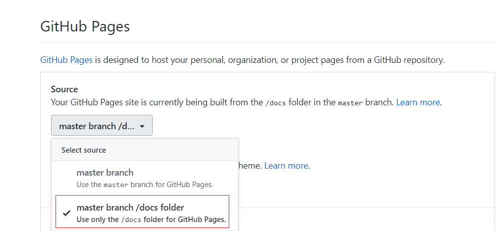

# 一个会动的简历模板

> This is a dynamic resume preiview use docs folder

[预览](https://crazybber.github.io/animating-resume)

## 使用方法

``` bash
git clone https://github.com/crazybber/animating-resume.git
cd animating-resume
npm install
npm run dev
```

## 部署方法

1. 编辑 config/index.js，修改第 10 行的 assetsPublicPath，值为 `你的输出目录(如:public)`。如果你没有修改项目名 animating-resume，则可跳过此步骤。

1. 修改debug模式下的访问端口，编辑：config/index.js，修改第26行。当前port: 80,

3. 编译、上传

```bash
    npm run build
    git add .
    git commit -m "update"
    git push origin master
```

4. 开启 GitHub Pages 功能

使用docs目录host站点
