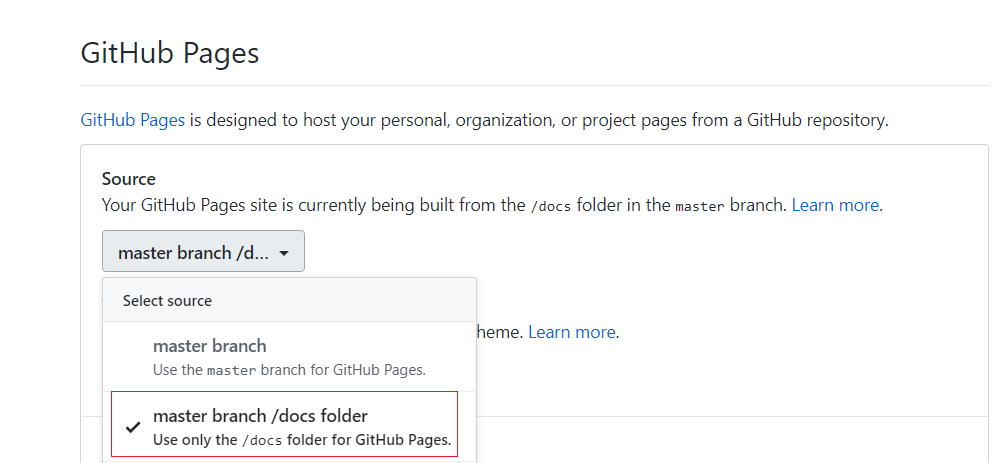

# 一个动态的自我介绍

> This is a dynamic resume preview use docs folder

[预览](https://crazybber.github.io/dynamic-introduce)

## 使用方法

``` bash
git clone https://github.com/crazybber/dynamic-introduce.git
cd animating-introduce
npm install
npm run dev
```

## 部署调试说明

1. 编辑 config/index.js，修改第 10 行的 assetsPublicPath，值为 `你的输出目录(如:public)`。如果你没有修改(当前是"./")，可跳过此步骤。

2. 修改debug模式下的访问端口，编辑：config/index.js，修改第26行。当前port: 80,

3. 编译、上传

```bash
    npm run build
    git add .
    git commit -m "update a site version"
    git push origin master
```

4. 开启 GitHub Pages 功能

使用docs目录host站点

